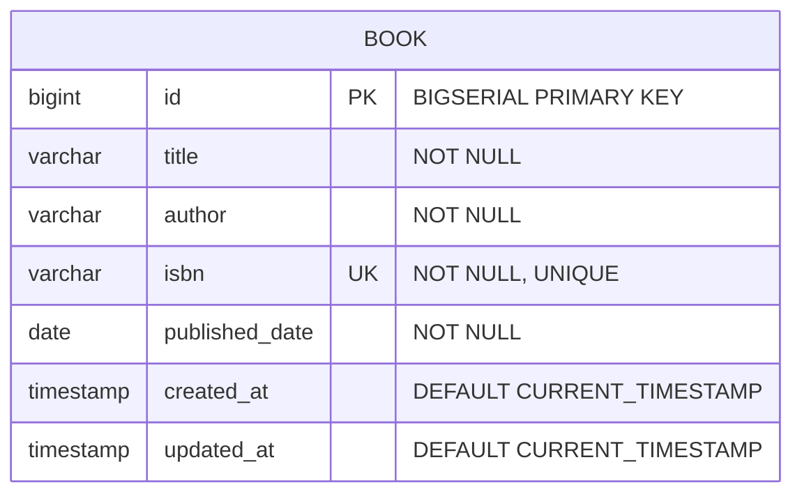

# 📚 Simple Book Management Microservice

[](https://www.oracle.com/java/)
[](https://spring.io/projects/spring-boot)
[](https://www.postgresql.org/)
[](https://flywaydb.org/)
[](http://localhost:8080/swagger-ui.html)
[](LICENSE)

Take-home Technical Assessment for **Junior Java Developer Role**  
**Candidate Name**: ISYANDI MUHAMMAD FADILLAH  
**Date Assigned**: August 5, 2026  
**Submission Due Date**: August 8, 2026  

---

## 📌 Executive Summary

**Simple Book Management Microservice** is a high-performance RESTful backend service developed using **Java 17** and **Spring Boot 3.3.5**. It provides complete CRUD operations on book inventory records with real-time payload validation, Flyway database migrations, PostgreSQL persistence, and global exception handling.

---

## 📐 Entity Relationship Diagram (ERD)



### Book Schema Definition
| Field | Data Type | Constraint | Description |
|---|---|---|---|
| `id` | `Long` / `BIGSERIAL` | `PRIMARY KEY`, `AUTO_INCREMENT` | Unique identifier |
| `title` | `String` / `VARCHAR(255)` | `NOT NULL` | Book Title |
| `author` | `String` / `VARCHAR(255)` | `NOT NULL` | Author Name |
| `isbn` | `String` / `VARCHAR(100)` | `NOT NULL`, `UNIQUE` | International Standard Book Number |
| `publishedDate` | `LocalDate` / `DATE` | `NOT NULL` | Publication Date |
| `createdAt` | `LocalDateTime` | `DEFAULT CURRENT_TIMESTAMP` | Entity creation timestamp |
| `updatedAt` | `LocalDateTime` | `DEFAULT CURRENT_TIMESTAMP` | Entity last update timestamp |

---

## ⚡ REST API Endpoints Specification

| Method | Endpoint | Description | Status Code |
|---|---|---|---|
| `POST` | `/api/books` | Add a new book | `201 Created` |
| `GET` | `/api/books` | Get all books | `200 OK` |
| `GET` | `/api/books/{id}` | Get a book by ID | `200 OK` / `404 Not Found` |
| `PUT` | `/api/books/{id}` | Full update of a book by ID | `200 OK` / `400 Bad Request` / `404 Not Found` |
| `PATCH` | `/api/books/{id}` | Partial update of a book by ID | `200 OK` / `404 Not Found` |
| `DELETE` | `/api/books/{id}` | Delete a book by ID | `204 No Content` / `404 Not Found` |

---

## 🛠️ Tech Stack & Key Features

* **Framework & Core**: Java 17, Spring Boot 3.3.5, Spring MVC, Spring Data JPA
* **Database & Migration**: PostgreSQL 16, Flyway DB Migration (`V1__create_books_table.sql`)
* **Validation & DTOs**: Jakarta Bean Validation (`@NotBlank`, `@PastOrPresent`), DTO Pattern (`BookCreateRequest`, `BookUpdateRequest`, `BookPatchRequest`, `BookResponse`)
* **Error Handling**: Global `@RestControllerAdvice` (`GlobalExceptionHandler.java`) returning standardized `ErrorResponse` payloads
* **Documentation**: Swagger OpenAPI 3 (`http://localhost:8080/swagger-ui.html`)
* **Testing**: JUnit 5 + Mockito Unit Tests (`BookServiceTest.java`) and MockMvc Integration Tests (`BookControllerTest.java`)
* **DevOps & Containers**: Docker & Docker Compose (`docker-compose.yml`)

---

## 🚀 How to Run the Project

### Option A: Running via Docker Compose (Recommended - Zero Setup)

Ensure Docker Desktop is running on your machine, then execute:

```bash
# Start PostgreSQL Database and Spring Boot Microservice in containers
docker-compose up --build -d

# Verify running containers
docker-compose ps
```

The application will start automatically at **`http://localhost:8080`**.

---

### Option B: Running Locally with Maven

#### 1. Start PostgreSQL
Ensure PostgreSQL is running locally on port `5432` with a database named `bookdb` (or update `.env` / `application.yml` credentials).

```sql
CREATE DATABASE bookdb;
```

#### 2. Run the Spring Boot Application
```bash
# Clean and package the application
mvn clean package

# Run the Spring Boot Microservice
mvn spring-boot:run
```

---

### Option C: Running Automated Tests

To execute unit and integration test suites using the H2 in-memory database test profile:

```bash
mvn test
```

---

## 🌐 Environment Variables

| Variable | Default Value | Description |
|---|---|---|
| `SERVER_PORT` | `8080` | Server HTTP Port |
| `SPRING_DATASOURCE_URL` | `jdbc:postgresql://localhost:5432/bookdb` | PostgreSQL JDBC Connection URL |
| `SPRING_DATASOURCE_USERNAME` | `postgres` | Database Username |
| `SPRING_DATASOURCE_PASSWORD` | `postgres` | Database Password |

---

## 🧪 Postman Collection & Swagger UI

### 1. Swagger OpenAPI 3 UI
Once the service is running, open your browser and navigate to:
👉 **[http://localhost:8080/swagger-ui.html](http://localhost:8080/swagger-ui.html)**

### 2. Postman Collection Export
A complete Postman Collection JSON is included in the root directory:
📄 [`postman_collection.json`](./postman_collection.json)

**How to Import into Postman**:
1. Open Postman.
2. Click **Import** -> Select `postman_collection.json`.
3. All 6 endpoints (`POST`, `GET`, `GET by ID`, `PUT`, `PATCH`, `DELETE`) are pre-configured with sample payloads.

---

## 📄 License & Candidate Information

**Candidate**: ISYANDI MUHAMMAD FADILLAH  
**Email**: [opiksendy@gmail.com](mailto:opiksendy@gmail.com)  
**GitHub**: [github.com/OpikSendy](https://github.com/OpikSendy)  
**License**: MIT License
