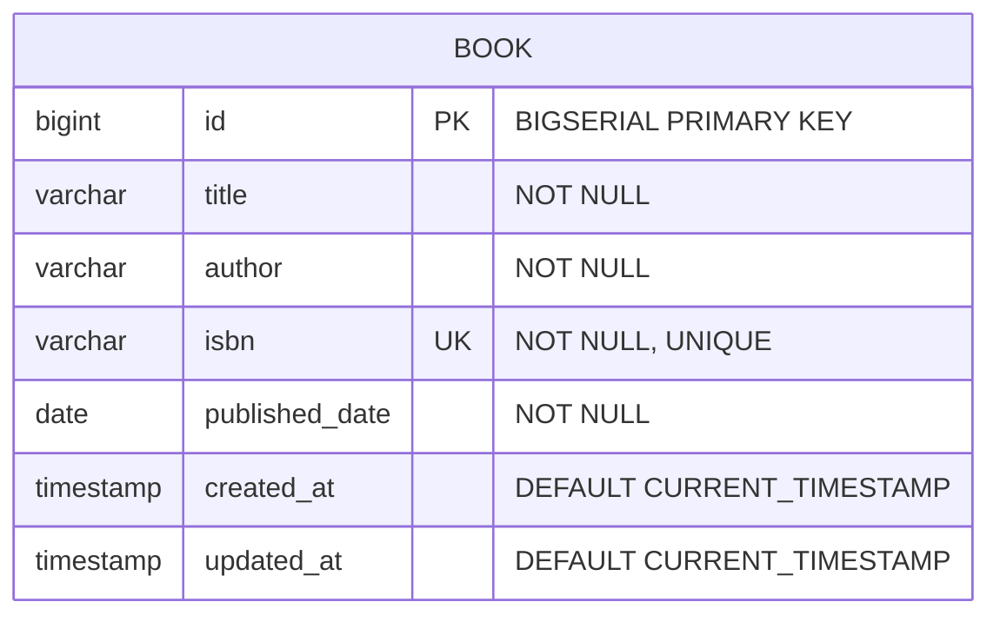

# 📚 Simple Book Management Microservice

[](https://www.oracle.com/java/)
[](https://spring.io/projects/spring-boot)
[](https://www.postgresql.org/)
[](https://flywaydb.org/)
[](http://localhost:8081/swagger-ui.html)
[](LICENSE)

Take-home Technical Assessment for **Junior Java Developer Role**  
**Candidate Name**: ISYANDI MUHAMMAD FADILLAH  
**Date Assigned**: August 5, 2026  
**Submission Due Date**: August 8, 2026  

---

## ⚡ Quick Start / TL;DR (Jalan dalam 2 Langkah - Zero Setup)

Untuk Tim IT / Reviewer yang ingin menguji aplikasi secara instant tanpa perlu install/setup database:

```bash
# 1. Clone Repository
git clone https://github.com/OpikSendy/springboot-microservice-task-IsyandiMuhammadFadillah.git
cd springboot-microservice-task-IsyandiMuhammadFadillah

# 2. Jalankan Aplikasi (Linux / macOS)
./mvnw spring-boot:run -Dspring-boot.run.profiles=test

# ATAU jika menggunakan Windows (PowerShell):
.\mvnw.cmd spring-boot:run "-Dspring-boot.run.profiles=test"
```

👉 **Aplikasi langsung Aktif**: **`http://localhost:8081`**  
👉 **Swagger UI Interaktif**: **`http://localhost:8081/swagger-ui.html`**  

---

## 📌 Executive Summary

**Simple Book Management Microservice** is a high-performance RESTful backend service developed using **Java 17** and **Spring Boot 3.3.5**. It provides complete CRUD operations on book inventory records with real-time payload validation, Flyway database migrations, PostgreSQL persistence, and global exception handling.

---

## 📐 Entity Relationship Diagram (ERD)



### Book Schema Definition
| Field | Data Type | Constraint | Description |
|---|---|---|---|
| `id` | `Long` / `BIGSERIAL` | `PRIMARY KEY`, `AUTO_INCREMENT` | Unique identifier |
| `title` | `String` / `VARCHAR(255)` | `NOT NULL` | Book Title |
| `author` | `String` / `VARCHAR(255)` | `NOT NULL` | Author Name |
| `isbn` | `String` / `VARCHAR(100)` | `NOT NULL`, `UNIQUE` | International Standard Book Number |
| `publishedDate` | `LocalDate` / `DATE` | `NOT NULL` | Publication Date |
| `createdAt` | `LocalDateTime` | `DEFAULT CURRENT_TIMESTAMP` | Entity creation timestamp |
| `updatedAt` | `LocalDateTime` | `DEFAULT CURRENT_TIMESTAMP` | Entity last update timestamp |

---

## ⚡ REST API Endpoints Specification

| Method | Endpoint | Description | Status Code |
|---|---|---|---|
| `POST` | `/api/books` | Add a new book | `201 Created` |
| `GET` | `/api/books` | Get all books | `200 OK` |
| `GET` | `/api/books/{id}` | Get a book by ID | `200 OK` / `404 Not Found` |
| `PUT` | `/api/books/{id}` | Full update of a book by ID | `200 OK` / `400 Bad Request` / `404 Not Found` |
| `PATCH` | `/api/books/{id}` | Partial update of a book by ID | `200 OK` / `404 Not Found` |
| `DELETE` | `/api/books/{id}` | Delete a book by ID | `204 No Content` / `404 Not Found` |

---

## 🚀 How to Run Options (Pilihan Cara Menjalankan Lengkap)

Tim IT / Reviewer dapat memilih **salah satu dari 3 cara di bawah ini**:

### ⚡ Option 1: Quickest 1-Command Start (Zero Setup - H2 Memory Database)
*Gunakan cara ini jika Anda ingin menguji aplikasi secara langsung tanpa perlu menginstal/menyiapkan PostgreSQL.*

```bash
# Untuk Linux / macOS:
./mvnw spring-boot:run -Dspring-boot.run.profiles=test

# Untuk Windows (PowerShell / Command Prompt):
.\mvnw.cmd spring-boot:run "-Dspring-boot.run.profiles=test"
```

---

### 🐳 Option 2: Running via Docker Compose (PostgreSQL Container)
*Gunakan cara ini jika komputer Anda memiliki Docker Desktop.*

```bash
# Otomatis menjalankan container PostgreSQL & Spring Boot Microservice
docker-compose up --build
```

---

### 🐘 Option 3: Local PostgreSQL + Maven Standard
*Gunakan cara ini jika Anda sudah memiliki PostgreSQL lokal di port 5432.*

1. Buat database di PostgreSQL:
   ```sql
   CREATE DATABASE bookdb;
   ```
2. Jalankan aplikasi:
   ```bash
   mvn spring-boot:run
   ```

---

## 🧪 Automated Unit & Integration Tests

Untuk menjalankan seluruh test suite (JUnit 5 + Mockito + MockMvc Integration Tests):

```bash
mvn test
# atau menggunakan wrapper:
./mvnw test
```

---

## 🌐 Environment Variables

| Variable | Default Value | Description |
|---|---|---|
| `SERVER_PORT` | `8081` | Server HTTP Port |
| `SPRING_DATASOURCE_URL` | `jdbc:postgresql://localhost:5432/bookdb` | PostgreSQL JDBC Connection URL |
| `SPRING_DATASOURCE_USERNAME` | `postgres` | Database Username |
| `SPRING_DATASOURCE_PASSWORD` | `postgres` | Database Password |

---

## 🧪 Postman Collection & Swagger UI

### 1. Swagger OpenAPI 3 UI
Setelah aplikasi berjalan, buka browser ke:  
👉 **[http://localhost:8081/swagger-ui.html](http://localhost:8081/swagger-ui.html)**

### 2. Postman Collection Export
File Postman Collection JSON resmi sudah disertakan di root project:  
📄 [`postman_collection.json`](./postman_collection.json)

**Cara Import ke Postman**:
1. Buka aplikasi Postman.
2. Klik **Import** -> Pilih file `postman_collection.json`.
3. Seluruh 6 endpoint (`POST`, `GET`, `GET by ID`, `PUT`, `PATCH`, `DELETE`) sudah terkonfigurasi lengkap dengan sample payload JSON.

---

## 📄 License & Candidate Information

**Candidate**: ISYANDI MUHAMMAD FADILLAH  
**Email**: [opiksendy@gmail.com](mailto:opiksendy@gmail.com)  
**GitHub**: [github.com/OpikSendy](https://github.com/OpikSendy)  
**License**: MIT License
