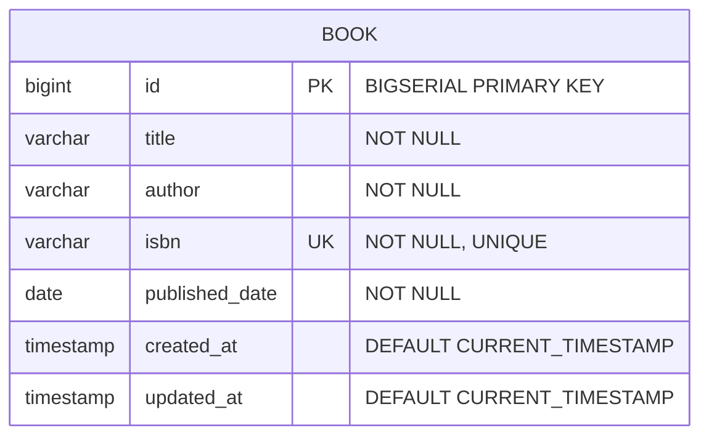

# Database Entity Relationship Diagram (ERD)

## Entity Relationship Diagram (Mermaid)

## Schema Field Definition

| Field Name | Data Type | Constraint | Description |
|---|---|---|---|
| `id` | `BIGSERIAL` / `Long` | `PRIMARY KEY`, `AUTO_INCREMENT` | Unique identifier for each book record |
| `title` | `VARCHAR(255)` / `String` | `NOT NULL` | Title of the book |
| `author` | `VARCHAR(255)` / `String` | `NOT NULL` | Full name of the book author |
| `isbn` | `VARCHAR(100)` / `String` | `NOT NULL`, `UNIQUE` | International Standard Book Number |
| `published_date` | `DATE` / `LocalDate` | `NOT NULL` | Publication date of the book |
| `created_at` | `TIMESTAMP` | `DEFAULT CURRENT_TIMESTAMP` | Record creation timestamp |
| `updated_at` | `TIMESTAMP` | `DEFAULT CURRENT_TIMESTAMP` | Record last modification timestamp |
